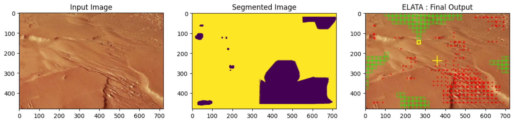
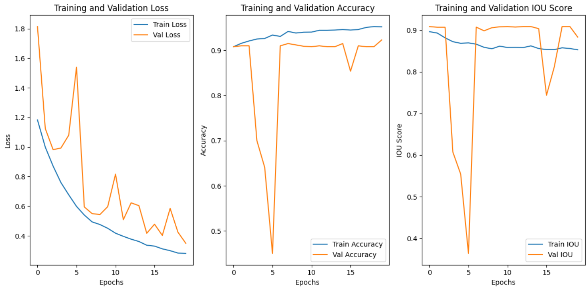

# ELATA: Extraterrestrial Land And Terrain Analysis

[](https://opensource.org/licenses/MIT)
[](https://www.python.org/downloads/)
[](https://www.tensorflow.org/)

> AI-powered terrain analysis for identifying optimal extraterrestrial landing zones.

---

## Demo



## Table of Contents

- [About The Project](#about-the-project)
- [Key Features](#key-features)
- [Tech Stack](#tech-stack)
- [Getting Started](#getting-started)
  - [Prerequisites](#prerequisites)
  - [Installation](#installation)
- [Usage](#usage)
- [Results](#results)
- [Authors](#authors)
- [License](#license)

## About The Project

Navigating and landing on extraterrestrial bodies presents significant challenges due to hazardous and unassessed terrain. This project provides a robust solution by leveraging deep learning to perform semantic segmentation on satellite-like imagery. By classifying terrain features such as craters, rocks, and flat plains, the system can programmatically identify potential hazards and compute the safest, most optimal landing zones for spacecraft or rovers.

## Key Features

* **Semantic Segmentation:** Utilizes a U-Net-based CNN architecture to classify terrain at a pixel level.
* **Hazard Identification:** Automatically flags dangerous terrain features based on segmentation output.
* **Optimal Zone Calculation:** Implements an algorithm to analyze safe zones and identify the largest, most stable area for landing.
* **High Performance:** Achieves a Mean Intersection over Union (IOU) score of **0.88** on the evaluation dataset.

## Tech Stack

* **Primary Language:** Python
* **Deep Learning:** TensorFlow, Keras
* **Data Manipulation:** NumPy, OpenCV
* **Visualization:** Matplotlib

## Getting Started

To get a local copy up and running, follow these simple steps.

### Prerequisites

Ensure you have Python 3.9+ installed on your system. This project also requires `pip` for package management.

### Installation

1.  Clone the repository to your local machine:
    ```sh
    git clone [https://github.com/Vaijayanthi-Sambath-Kumar/elata-terrain-analysis.git](https://github.com/Vaijayanthi-Sambath-Kumar/elata-terrain-analysis.git)
    cd elata-terrain-analysis
    ```
2.  Install the required Python packages:
    ```sh
    pip install -r requirements.txt
    ```

## Usage

1.  Open the main project notebook:
    ```sh
    jupyter notebook "main.ipynb"
    ```
    **[Note: Update the filename if it's different.]**
2.  Follow the steps within the notebook to load the data, train the model, and run predictions on new images.

## Results

The model was trained and evaluated, achieving the following performance:

* **Mean IOU Score:** 0.88

[**Optional but Recommended:** Include a plot of your training/validation loss curve here as an image.]

Loss, Accuracy, and IOU score over 20 epochs.




## Authors

This was a collaborative project.

* **Vaijayanthi Sambath Kumar** - https://www.linkedin.com/in/vaijayanthi-sambath-kumar/
* **Sanket Balani** - https://www.linkedin.com/in/sanket-balani/

## License

This project is licensed under the MIT License. See the `LICENSE` file for more details.